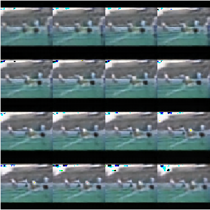
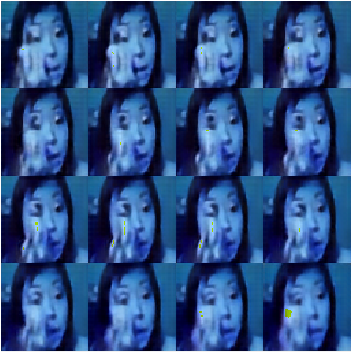
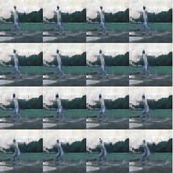
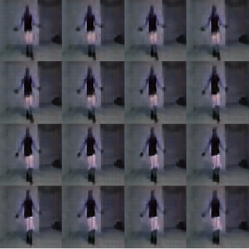

# VideoVQVAE
This project implements VQVAE for quantizing video input

## prepare dataset

download UCF101 [here](https://www.crcv.ucf.edu/research/data-sets/ucf101/).
download train/test split configure [here](https://www.crcv.ucf.edu/data/UCF101/UCF101TrainTestSplits-RecognitionTask.zip).

unzip the compressed files.

generate dataset with command

```shell
python3 create_dataset.py --ucf_root=</path/to/UCF101/directory> --train_list=</path/to/train/list> --test_list=</path/to/test/list>
```

after exeucting the command successfully, trainset.tfrecord and testset.tfrecord are created.

## train model

train Video VQVAE with the following command

```shell
python3 train.py [--use_2d]
```

## save model from checkpoint

save the latest checkpoint with the following command

```shell
python3 save_model.py [--use_2d]
```

the trained model is saved under directory models

## test the model

test the model with command

```shell
python3 test.py [--use_2d]
```

the original video clip and the reconstructed video clip will be shown side by side.

## experimental results

<p align="center">
  <table>
    <caption>experimental results</caption>
    <tr><td></td><td></td></tr>
    <tr><td></td><td></td></tr>
  </table>
</p>

